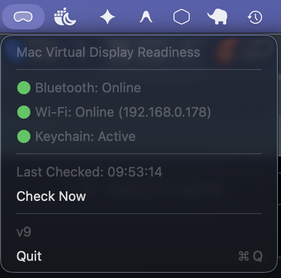

# AVP MVD Watcher Menu Bar



A native macOS menu bar utility built in SwiftUI that displays whether your Mac is ready to connect to the Apple Vision Pro (AVP) feature **Mac Virtual Display (MVD)**.

## Features

- **Monochrome Status Icon**: Follows macOS menu bar guidelines with a clean Apple Vision Pro headset symbol (`visionpro`).
  - Shows the standard headset icon when all systems are ready.
  - Shows the badge icon (`visionpro.badge.exclamationmark`) when any system is offline.
- **Adaptive Check Frequencies**:
  - Automatically checks status every **30 seconds** when all systems are go.
  - Switches to a **10-second** refresh rate when at least one system is down to support active troubleshooting.
- **Detailed Dropdown Menu**: Clicking the status icon displays individual status indicators with green/red status dots:
  - **Bluetooth Status** (using `IOBluetooth` to check controller power).
  - **Wi-Fi Status** (using `CoreWLAN` and BSD sockets to check interface IP address).
  - **Keychain Status** (using Keychain API calls to ensure responsiveness of security services).
- **Manual Control**: Force an immediate update via the "Check Now" button.
- **100% Native**: Performs all checks without launching external shell processes.

## Prerequisites

- macOS 14.0 or newer.
- Xcode 15+ or Xcode Command Line Tools.

## Compilation & Usage

1. Open your terminal in the project root:
   ```bash
   cd ~/code/avp-mvd-menu-bar
   ```
2. Build the project in release mode:
   ```bash
   swift build -c release
   ```
3. Run the compiled executable in the background:
   ```bash
   ./.build/release/AVPMVDMenuBar &
   ```

*(Optionally, you can run `./package.sh` to package it into `.build/release/AVPMVDMenuBar.app` and launch it with `open .build/release/AVPMVDMenuBar.app`).*
