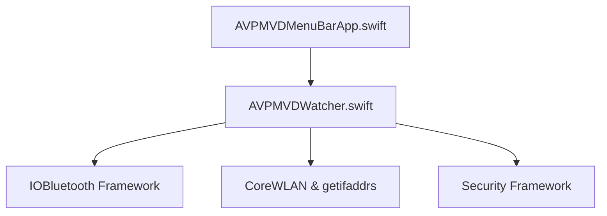

# Architecture

The AVP MVD Watcher Menu Bar utility is a lightweight native macOS application designed to run in the system status bar (menu bar).

## System Components

- **App (AVPMVDMenuBarApp)**: Sets up the SwiftUI entry point, sets the application activation policy to `.accessory` to hide it from the Dock, and renders a native `MenuBarExtra` scene.
- **ViewModel (AVPMVDWatcher)**: Manages state, triggers checks on a background task, and dynamically updates the checking interval (30 seconds when all system statuses are healthy, 10 seconds when at least one status is unhealthy).
- **CoreBluetooth/IOBluetooth**: System API to query the host's Bluetooth controller power state.
- **CoreWLAN & BSD Sockets**: Queries the active Wi-Fi interface and pulls its IPv4 address natively.
- **Security Services**: Uses Keychain API calls (`SecItemCopyMatching`) to test keychain daemon availability.
