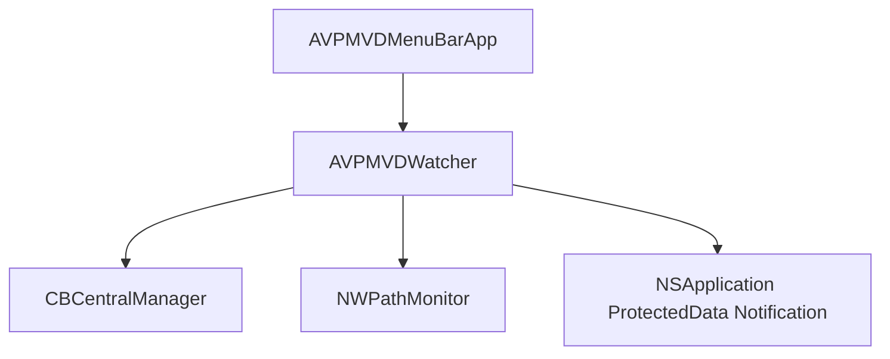

# Design: Event-Driven Watcher

This document specifies the design for transitioning from polling-based state checks to notification-based observation in the AVP MVD Watcher Menu Bar utility.

## User Story
As a macOS user hosting Apple Vision Pro Mac Virtual Display sessions, I want my menu bar utility to detect Bluetooth, Wi-Fi, and Keychain status changes instantly and efficiently without draining system resources through active polling.

## Backlog
- Create custom observer components/managers for Bluetooth, Wi-Fi, and Keychain.
- Refactor `AVPMVDWatcher` to initialize these observers and react to their state updates.
- Keep support for initial/force checks when the application starts or when the user manually clicks "Check Now".
- Remove the `Timer` polling logic.

## Architecture
Rather than checking states periodically:
- **Bluetooth State:** Observed via `CBCentralManager` delegate callbacks.
- **Wi-Fi Connection:** Observed via `NWPathMonitor` updates.
- **Keychain Availability:** Observed via `NSApplicationProtectedDataDidBecomeAvailableNotification` / `NSApplicationProtectedDataWillBecomeUnavailableNotification`.

## Requirements
- Maintain backward compatibility with the existing UI in `AVPMVDMenuBarApp.swift`.
- Must compile successfully on macOS 14.0+.
- No compiler warnings.
- The UI should instantly update when Bluetooth or Wi-Fi is toggled.
