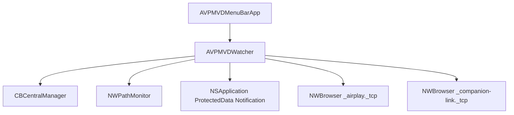

# Design: Detect Vision Pro on Network

This document details the design for implementing network discovery of Apple Vision Pro devices on the local network using Bonjour, adding the check to the menu bar application.

## User Story
As a macOS user preparing to start a Mac Virtual Display session, I want my menu bar utility to detect if my Apple Vision Pro is online and reachable on the local network, so that I know if I can connect immediately.

## Backlog
- Add local network and Bonjour entitlements/Info.plist keys to the build system.
- Implement two `NWBrowser` service monitors targeting `_airplay._tcp` and `_companion-link._tcp`.
- Filter discovered services:
  - If AirPlay: Check for metadata `txtRecord["model"]` containing the `"RealityDevice"` signature.
  - If Companion-Link: Check if the service name contains keywords (`avp`, `vision`, `reality`, `headset`) and is not the host Mac's own localized name.
- Expose the combined detection state as `@Published` property `isVisionProOnline` on `AVPMVDWatcher`.
- Display the status row in the SwiftUI menu interface under `AVPMVDMenuBarApp`.
- Adapt the menu bar icon based on the detection state:
  - If local systems are down: `visionpro.badge.exclamationmark`
  - If local systems are up but Vision Pro is not detected: `visionpro.slash`
  - If local systems are up and Vision Pro is detected: `visionpro`

## Architecture

## Requirements
- Target macOS 14.0+.
- No compiler warnings.
- The UI should show "Vision Pro: Detected" (Green) or "Vision Pro: Not Detected" (Gray).
- Clicking "Check Now" should force a fresh network scan by restarting both browsers.
