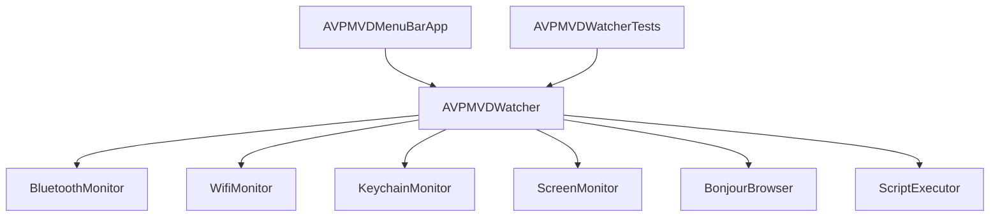

# Design: Keyboard Shortcuts, Disconnect, and Unit Test Backfill

This document details the design for adding keyboard shortcuts for connection and disconnection to the Apple Vision Pro (AVP) Mac Virtual Display (MVD) menu bar app, as well as introducing a unit testing suite to backfill tests.

## User Story
As a macOS user, I want keyboard shortcuts to quickly connect and disconnect my host Mac to/from my Apple Vision Pro MVD session. The connect shortcut should only be active when the AVP is detected, and the disconnect shortcut should only be active when the AVP is connected. I also want robust unit test coverage to ensure the app's business logic behaves reliably under different network and service states.

## Backlog
- Refactor package structure in `Package.swift` to introduce `AVPMVDCore` library target, `AVPMVDMenuBar` executable target, and `AVPMVDMenuBarTests` test target.
- Refactor `AVPMVDWatcher` to use protocols/dependency injection for its system-level interactions:
  - `BluetoothMonitor`
  - `WifiMonitor`
  - `KeychainMonitor`
  - `ScreenMonitor`
  - `BonjourBrowser`
  - `ScriptExecutor`
- Implement concrete implementations wrapping system frameworks (CoreBluetooth, CoreWLAN, Security, Network, AppleScript, AppKit).
- Implement a `disconnectMVD()` function on `AVPMVDWatcher` that runs an AppleScript to toggle the active Screen Mirroring/Sidecar connection.
- Update `AVPMVDMenuBarApp` to render a click-to-disconnect button when AVP is connected.
- Bind `⌥⌘C` (Option-Command-C) to the connect action button.
- Bind `⌥⌘D` (Option-Command-D) to the disconnect action button.
- Implement comprehensive unit tests in `Tests/AVPMVDWatcherTests.swift`.

## Architecture

All system dependencies are abstracted behind protocols and injected via initializer parameters (defaulting to production services), making the core business logic unit-testable.

## Requirements
- Target macOS 14.0+.
- No compiler warnings.
- Complete unit test suite verifying states, transitions, icons, formatting, and script invocation parameters.
