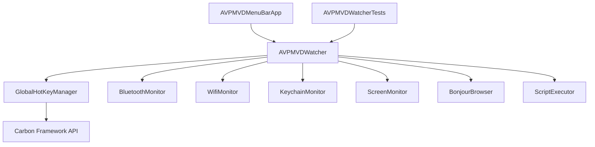

# Design: Keyboard Shortcuts, Disconnect, and Unit Test Backfill

This document details the design for adding keyboard shortcuts for connection and disconnection to the Apple Vision Pro (AVP) Mac Virtual Display (MVD) menu bar app, as well as introducing a unit testing suite to backfill tests.

## User Story
As a macOS user, I want global keyboard shortcuts to quickly connect and disconnect my host Mac to/from my Apple Vision Pro MVD session without needing to open the menu bar dropdown first. The connect shortcut should only be active when the AVP is detected, and the disconnect shortcut should only be active when the AVP is connected. I also want robust unit test coverage to ensure the app's business logic behaves reliably.

## Backlog
- Refactor package structure in `Package.swift` to introduce `AVPMVDCore` library target, `AVPMVDMenuBar` executable target, and `AVPMVDMenuBarTests` test target.
- Refactor `AVPMVDWatcher` to use protocols/dependency injection for its system-level interactions.
- Implement a `disconnectMVD()` function on `AVPMVDWatcher` that runs an AppleScript to toggle the active Screen Mirroring/Sidecar connection.
- Implement `GlobalHotKeyManager` utilizing the Carbon framework's `RegisterEventHotKey` API to listen for `⌥⌘C` (Option-Command-C) and `⌥⌘D` (Option-Command-D) globally.
- Bind the connect hotkey callback to `connectMVD` (guarded by state) and the disconnect hotkey callback to `disconnectMVD` (guarded by state).
- Update `AVPMVDMenuBarApp` to render a click-to-disconnect button when AVP is connected, displaying the shortcut hints in the dropdown.
- Implement comprehensive unit tests in `Tests/AVPMVDWatcherTests.swift`.

## Architecture

All system dependencies are abstracted behind protocols. Global hotkeys are captured using native macOS Carbon wrappers and dispatched to state-controlled callbacks on the MainActor.

## Requirements
- Target macOS 14.0+.
- No compiler warnings.
- Shortcuts must work globally (with dropdown closed).
- Complete unit test suite verifying states, transitions, icons, formatting, and script invocation parameters.
